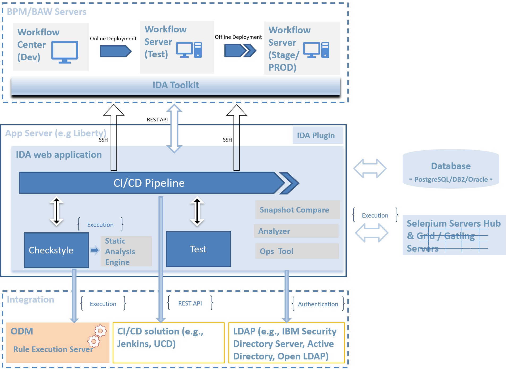

# Architecture
***

## Integration Architecture

1. IDA communications with BAW servers by REST API.
2. SSH is needed to support IDA pipeline deployment feature, if the BAW server version is prior to version 18.0.0.2.
3. To gain full function of testing feature, [IDA toolkit](https://sdc-china.github.io/IDA-doc/installation/installation-ida-installing.html#step-2-installing-ida-baw-toolkit) needs to be installed in the BAW application.
4. To record and replay test case by browser, [IDA Plugin](https://sdc-china.github.io/IDA-doc/installation/installation-ida-installing.html#step-3-installing-ida-browser-plug-in) need to be installed in user's browser(Chrome or Firefox).
5. IDA connects to Database by TCP protocol.
6. IDA connects to Selenium Server by HTTP protocol.
7. [IBM Operational Decision Manager](https://www.ibm.com/us-en/marketplace/operational-decision-manager) will be used to replace OOTB static analysis POJO engine so that all static analysis rules could be customized and managed outside IDA solution. IDA integrate with ODM by REST API. 
8. IDA provides [REST API](https://sdc-china.github.io/IDA-doc/references/references-apis.html) to support third party CI/CD tools. Basic authentication method is used to authorize IDA REST API access.
9. IDA supports LDAP server for user authentication.

## Deployment Architecture

