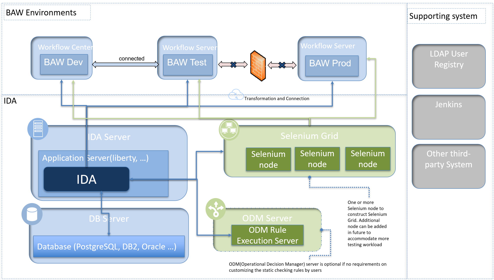

# Architecture
***

## Integration Architecture

1. IDA communicates with BAW servers by REST API using the basic authentication method.
2. SSH is needed to support the IDA pipeline deployment feature if the BAW server version is prior to 18.0.0.2.
3. To gain full functionality of the testing feature, the [IDA toolkit](../installation/installation-installing-ida-application.html#step-2-installing-ida-baw-toolkit) needs to be installed in the BAW application.
4. To record and replay test cases by browser, the [IDA Plugin](../installation/installation-installing-ida-application.html#step-3-installing-ida-browser-plug-in) needs to be installed in the user's browser (Chrome or Firefox).
5. IDA connects to the Database by TCP protocol.
6. IDA connects to the Selenium Server by HTTP protocol.
7. [IBM Operational Decision Manager](https://www.ibm.com/us-en/marketplace/operational-decision-manager) will be used to replace the out-of-the-box (OOTB) static analysis POJO engine so that all static analysis rules could be customized and managed outside the IDA solution. IDA integrates with ODM by REST API using the basic authentication method.
8. IDA provides [REST API](../references/references-ida-rest-apis.html) to support third-party CI/CD tools. The basic authentication method is used to authorize IDA REST API access.
9. IDA supports an LDAP server for user authentication.

## Deployment Architecture
